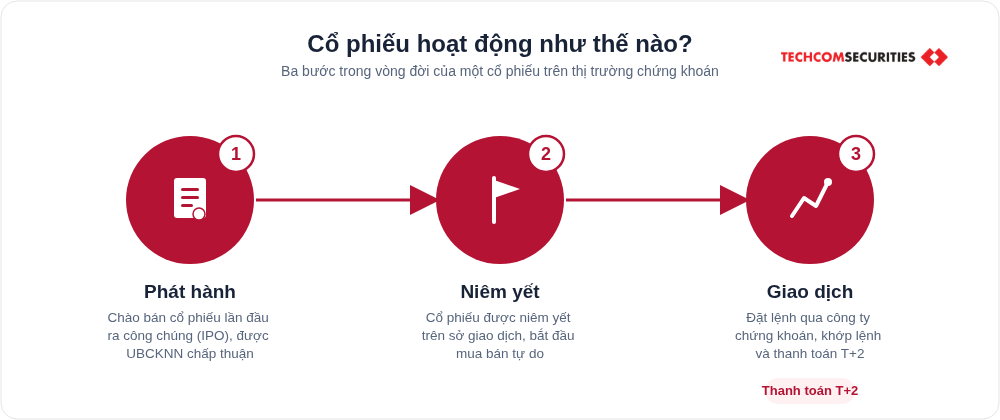

## Meta description

Cổ phiếu là gì, có mấy loại, hoạt động ra sao và vì sao nhiều người chọn đầu tư cổ phiếu. Giải thích đầy đủ kèm rủi ro cần biết trước khi bắt đầu.

## Nội dung bài viết

# Cổ phiếu là gì? Vì sao nên đầu tư cổ phiếu?

Cổ phiếu là loại chứng khoán xác nhận quyền và lợi ích hợp pháp của người sở hữu đối với một phần vốn của công ty phát hành. Nói đơn giản, mua một cổ phiếu là mua một phần nhỏ trong công ty đó, và người mua trở thành đồng chủ sở hữu công ty theo tỷ lệ số cổ phiếu đang nắm giữ.


Cổ phiếu tồn tại dưới dạng chứng chỉ giấy hoặc phổ biến hơn hiện nay là bút toán ghi sổ trong hệ thống của trung tâm lưu ký. Mỗi công ty cổ phần khi thành lập đều chia vốn điều lệ thành các phần bằng nhau gọi là cổ phần, và cổ phiếu chính là giấy xác nhận quyền sở hữu với các cổ phần đó.

## Người sở hữu cổ phiếu gọi là gì

Người nắm giữ cổ phiếu của một công ty được gọi là cổ đông. Là cổ đông, nhà đầu tư có ba quyền cơ bản gồm quyền được chia cổ tức khi công ty có lợi nhuận, quyền tham gia và biểu quyết tại đại hội cổ đông với cổ phiếu thường, và quyền được ưu tiên mua thêm cổ phiếu khi công ty phát hành thêm. Số quyền cụ thể phụ thuộc vào loại cổ phiếu đang nắm giữ và tỷ lệ sở hữu.

## Hai loại cổ phiếu phổ biến trên thị trường

Theo Luật Doanh nghiệp và Luật Chứng khoán hiện hành, cổ phiếu được chia thành hai nhóm chính.

### Cổ phiếu thường

Cho phép cổ đông tự do chuyển nhượng, được biểu quyết các vấn đề quan trọng của công ty tại đại hội cổ đông, và được chia cổ tức theo kết quả kinh doanh thực tế từng năm. Đây là loại cổ phiếu chiếm đa số trên thị trường và cũng là loại nhà đầu tư cá nhân giao dịch hàng ngày trên sàn.

### Cổ phiếu ưu đãi

Mang lại mức cổ tức cố định hoặc ưu tiên nhận cổ tức trước cổ phiếu thường, kể cả khi công ty kinh doanh không thuận lợi trong năm đó. Đổi lại, cổ đông sở hữu cổ phiếu ưu đãi thường không có quyền biểu quyết như cổ đông thường. Loại cổ phiếu này phù hợp với nhà đầu tư ưu tiên dòng tiền ổn định hơn là tăng trưởng giá.

| Tiêu chí | Cổ phiếu thường | Cổ phiếu ưu đãi |
|---|---|---|
| Quyền biểu quyết | Có | Thường không có |
| Cổ tức | Theo kết quả kinh doanh, không cố định | Cố định hoặc ưu tiên nhận trước |
| Mức độ phổ biến trên sàn | Rất phổ biến | Ít giao dịch hơn |
| Phù hợp với | Nhà đầu tư chấp nhận biến động để tìm tăng trưởng | Nhà đầu tư ưu tiên dòng tiền ổn định |

## Cổ phiếu hoạt động như thế nào

Một cổ phiếu đi qua ba giai đoạn chính trong vòng đời của nó trên thị trường chứng khoán.

* Phát hành: công ty chào bán cổ phiếu lần đầu ra công chúng, thường gọi là IPO, sau khi được Ủy ban Chứng khoán Nhà nước chấp thuận. Đây là bước công ty huy động vốn để mở rộng sản xuất kinh doanh.
* Niêm yết: cổ phiếu được đưa lên giao dịch chính thức tại một sở giao dịch chứng khoán, chẳng hạn HOSE hoặc HNX, và từ đây có thể mua bán tự do giữa các nhà đầu tư với nhau, không chỉ giới hạn ở nhà đầu tư ban đầu.
* Giao dịch: nhà đầu tư đặt lệnh mua hoặc bán qua công ty chứng khoán, hệ thống khớp lệnh trên sàn, và giao dịch được thanh toán theo chu kỳ T cộng 2, nghĩa là tiền và cổ phiếu về tài khoản sau 2 ngày làm việc kể từ ngày khớp lệnh.



## Vì sao nên đầu tư cổ phiếu

Có ba lý do chính khiến cổ phiếu là một trong những kênh đầu tư được lựa chọn nhiều nhất tại Việt Nam.

* Lợi nhuận vượt trội trong dài hạn: cổ phiếu sinh lời từ hai nguồn cộng lại, phần tăng giá khi bán ra cao hơn giá mua vào, và phần cổ tức nhận được trong thời gian nắm giữ. Cách tính đơn giản là lấy giá bán trừ giá mua, cộng thêm cổ tức đã nhận, rồi chia cho giá mua ban đầu để ra tỷ suất sinh lời theo phần trăm. Với doanh nghiệp có nền tảng tốt, mức sinh lời dài hạn thường vượt lãi suất tiết kiệm ngân hàng, tuy mức chênh lệch cụ thể thay đổi theo từng giai đoạn thị trường và không được đảm bảo cố định.
* Thanh khoản cao: cổ phiếu niêm yết trên sàn có thể mua hoặc bán ngay trong phiên giao dịch, tiền bán ra chuyển thành tiền mặt trong tài khoản sau 2 ngày làm việc theo chu kỳ thanh toán hiện hành. So với bất động sản hoặc gửi tiết kiệm có kỳ hạn, đây là lợi thế rõ rệt khi cần chủ động về dòng tiền.
* Linh hoạt về vốn và thời gian: nhờ cơ chế giao dịch lô lẻ hiện nay, nhà đầu tư có thể mua cổ phiếu chỉ với vài trăm nghìn đến vài triệu đồng tùy mức giá từng mã, không cần vốn lớn để bắt đầu. Thời gian nắm giữ hoàn toàn do nhà đầu tư quyết định, có thể bán lại bất kỳ lúc nào phù hợp mục tiêu tài chính cá nhân.

## Rủi ro cần biết trước khi đầu tư cổ phiếu

Bên cạnh cơ hội sinh lời, cổ phiếu cũng đi kèm rủi ro thực sự cần hiểu rõ trước khi tham gia.

* Giá giảm theo biến động chung của thị trường, không chỉ do riêng doanh nghiệp.
* Kết quả kinh doanh của doanh nghiệp không như kỳ vọng khiến giá cổ phiếu đi xuống.
* Không được bảo đảm gốc như tiền gửi tiết kiệm, có thể chịu lỗ nếu bán ra ở mức giá thấp hơn giá mua.

Để giảm thiểu rủi ro, nhà đầu tư mới nên bắt đầu với số vốn nhỏ, dành thời gian tìm hiểu doanh nghiệp trước khi mua, và phân bổ vốn vào nhiều mã cổ phiếu thuộc các ngành khác nhau thay vì tập trung toàn bộ vào một mã duy nhất.

## Bắt đầu đầu tư cổ phiếu từ đâu

Để bắt đầu, nhà đầu tư cần mở một tài khoản giao dịch chứng khoán tại một công ty chứng khoán được cấp phép, nộp tiền vào tài khoản, sau đó có thể đặt lệnh mua cổ phiếu ngay qua ứng dụng hoặc nền tảng giao dịch của công ty chứng khoán đó. Trước khi đặt lệnh, nên tìm hiểu cơ bản về doanh nghiệp định mua, bao gồm tình hình kinh doanh, ngành nghề hoạt động và mức giá đang giao dịch trên sàn so với giá trị thực của doanh nghiệp.

## Câu hỏi thường gặp

**Cổ phiếu và chứng khoán có phải là một không?**

Không hoàn toàn. Chứng khoán là khái niệm rộng bao gồm nhiều loại công cụ tài chính như cổ phiếu, trái phiếu, chứng chỉ quỹ và chứng quyền. Cổ phiếu chỉ là một loại trong số đó.

**Mua cổ phiếu lần đầu cần bao nhiêu tiền?**

Nhờ cơ chế giao dịch lô lẻ, nhà đầu tư có thể bắt đầu chỉ với vài trăm nghìn đồng tùy theo giá của mã cổ phiếu muốn mua, không bắt buộc phải có số vốn lớn.

**Nên chọn cổ phiếu thường hay cổ phiếu ưu đãi?**

Điều này phụ thuộc vào mục tiêu đầu tư. Cổ phiếu thường phù hợp với người muốn tìm kiếm tăng trưởng giá và sẵn sàng chấp nhận biến động, còn cổ phiếu ưu đãi phù hợp với người ưu tiên dòng cổ tức ổn định hơn.

**Rủi ro lớn nhất khi đầu tư cổ phiếu là gì?**

Rủi ro lớn nhất là khả năng mất một phần vốn khi giá cổ phiếu giảm, do khoản đầu tư này không được bảo đảm gốc như tiền gửi tiết kiệm. Rủi ro này có thể giảm bớt bằng cách tìm hiểu kỹ doanh nghiệp và phân bổ vốn vào nhiều mã khác nhau.

## CTA

Một CTA duy nhất ở cuối bài, dạng "Sẵn sàng mở tài khoản để bắt đầu giao dịch cổ phiếu", dẫn tới trang mở tài khoản của TCBS: https://onboarding.tcbs.com.vn/onboarding

## Schema đề xuất

Article, FAQPage (khớp 4 câu hỏi ở trên), BreadcrumbList theo Trang chủ / Thông tin / Cổ phiếu.

```json
{
  "@context": "https://schema.org",
  "@graph": [
    {
      "@type": "Article",
      "headline": "Cổ phiếu là gì? Vì sao nên đầu tư cổ phiếu?",
      "description": "Cổ phiếu là gì, có mấy loại, hoạt động ra sao và vì sao nhiều người chọn đầu tư cổ phiếu. Giải thích đầy đủ kèm rủi ro cần biết trước khi bắt đầu.",
      "author": { "@type": "Organization", "name": "Đội ngũ nội dung TCBS" },
      "publisher": { "@type": "Organization", "name": "TCBS" },
      "mainEntityOfPage": "https://www.tcbs.com.vn/thong-tin/co-phieu/co-phieu-la-gi-vi-sao-nen-dau-tu-co-phieu/"
    },
    {
      "@type": "FAQPage",
      "mainEntity": [
        { "@type": "Question", "name": "Cổ phiếu và chứng khoán có phải là một không?", "acceptedAnswer": { "@type": "Answer", "text": "Không hoàn toàn. Chứng khoán là khái niệm rộng bao gồm nhiều loại công cụ tài chính như cổ phiếu, trái phiếu, chứng chỉ quỹ và chứng quyền. Cổ phiếu chỉ là một loại trong số đó." } },
        { "@type": "Question", "name": "Mua cổ phiếu lần đầu cần bao nhiêu tiền?", "acceptedAnswer": { "@type": "Answer", "text": "Nhờ cơ chế giao dịch lô lẻ, nhà đầu tư có thể bắt đầu chỉ với vài trăm nghìn đồng tùy theo giá của mã cổ phiếu muốn mua." } },
        { "@type": "Question", "name": "Nên chọn cổ phiếu thường hay cổ phiếu ưu đãi?", "acceptedAnswer": { "@type": "Answer", "text": "Cổ phiếu thường phù hợp với người muốn tìm kiếm tăng trưởng giá, còn cổ phiếu ưu đãi phù hợp với người ưu tiên dòng cổ tức ổn định." } },
        { "@type": "Question", "name": "Rủi ro lớn nhất khi đầu tư cổ phiếu là gì?", "acceptedAnswer": { "@type": "Answer", "text": "Rủi ro lớn nhất là khả năng mất một phần vốn khi giá cổ phiếu giảm, do khoản đầu tư này không được bảo đảm gốc." } }
      ]
    },
    {
      "@type": "BreadcrumbList",
      "itemListElement": [
        { "@type": "ListItem", "position": 1, "name": "Trang chủ", "item": "https://www.tcbs.com.vn/" },
        { "@type": "ListItem", "position": 2, "name": "Thông tin", "item": "https://www.tcbs.com.vn/thong-tin/kham-pha-chia-se/" },
        { "@type": "ListItem", "position": 3, "name": "Cổ phiếu", "item": "https://www.tcbs.com.vn/thong-tin/co-phieu/" }
      ]
    }
  ]
}
```

## Ảnh dùng trong bài

* `co-phieu-hero-phan-tich.png`: đặt đầu bài.
* `co-phieu-hoat-dong-nhu-the-nao.png`: đặt trong mục Cổ phiếu hoạt động như thế nào.

## Byline

Do Đội ngũ nội dung TCBS biên soạn
